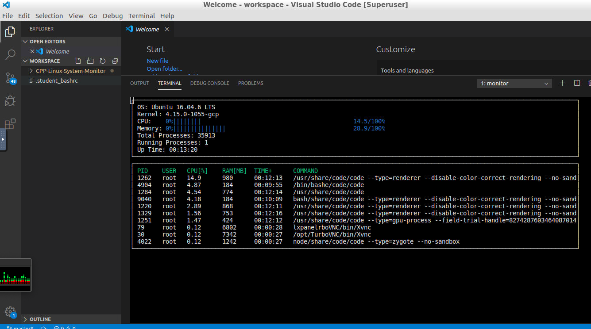

# Linux System Monitor

The Linux System Monitor app, was made as part of Udacity's [C++ Nanodegree Program](https://www.udacity.com/course/c-plus-plus-nanodegree--nd213). 
The  Linux System Monitor allows users to observe live some of the main OS informations and the resources that is taken by runing processes in a Linux Operating System. 
This is the OS name, the OS kernel version, like CPU and memory percentage of usage, the number of the system processes, the system up-time.
In more detailed users can se for each of the process infos like process ID, the user started it, the CPU usage, the memory consuming, the up-time and by wich command started.

# Dependencies for Running Locally

## ncurses
[ncurses](https://www.gnu.org/software/ncurses/) is a library that facilitates text-based graphical output in the terminal. This project relies on ncurses for display output.

Within the Udacity Workspace, `.student_bashrc` automatically installs ncurses every time you launch the Workspace.

If you are not using the Workspace, install ncurses within your own Linux environment: `sudo apt install libncurses5-dev libncursesw5-dev`

# Compiling and Running

## Make
This project uses [Make](https://www.gnu.org/software/make/). The Makefile has four targets:
* `build` compiles the source code and generates an executable
* `format` applies [ClangFormat](https://clang.llvm.org/docs/ClangFormat.html) to style the source code
* `debug` compiles the source code and generates an executable, including debugging symbols
* `clean` deletes the `build/` directory, including all of the build artifacts

## Instructions

1. Clone the project repository: `git clone https://github.com/vatsilidis/Cpp-Linux-System-Monitor.git`

2. Build the project: `make build`

3. Run the resulting executable: `./build/monitor`

4. Follow along with the lesson.

5. Implement the `System`, `Process`, and `Processor` classes, as well as functions within the `LinuxParser` namespace.

6. Submit!

# Credits

## Used resources

[The starter code for System Monitor Project](https://www.udacity.com/course/c-plus-plus-nanodegree--nd213). 

# Contributors
* [Lampros Vatsilidis](https://www.linkedin.com/in/lampros-vatsilidis-5666ba128/)
* [Udacity C++ Nanodegree Program](https://www.udacity.com/course/c-plus-plus-nanodegree--nd213) 
